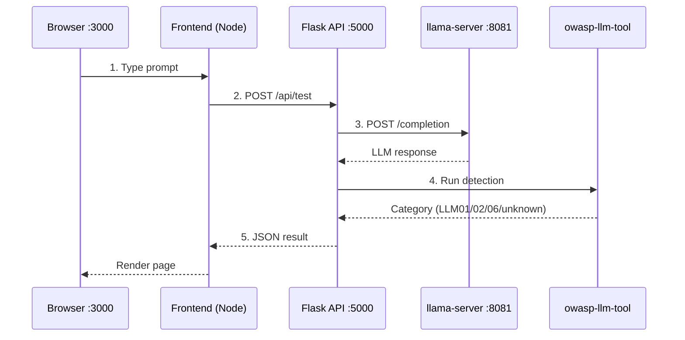

# Architecture

TODO

## Request Flow

## Components

| Component | Port | Purpose |
|-----------|------|---------|
| Frontend (Node) | 3000 | Web UI |
| Flask API | 5000 | Orchestration |
| llama-server | 8081 | LLM inference |
| owasp-llm-tool | - | OWASP category detection |

